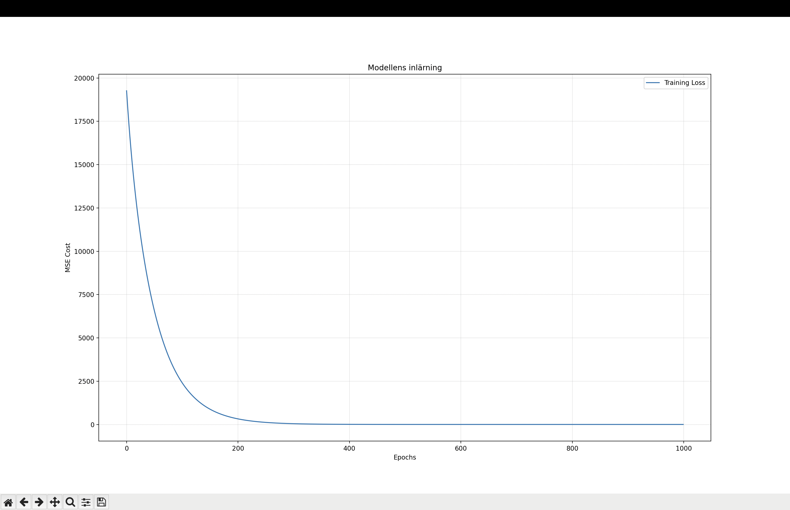
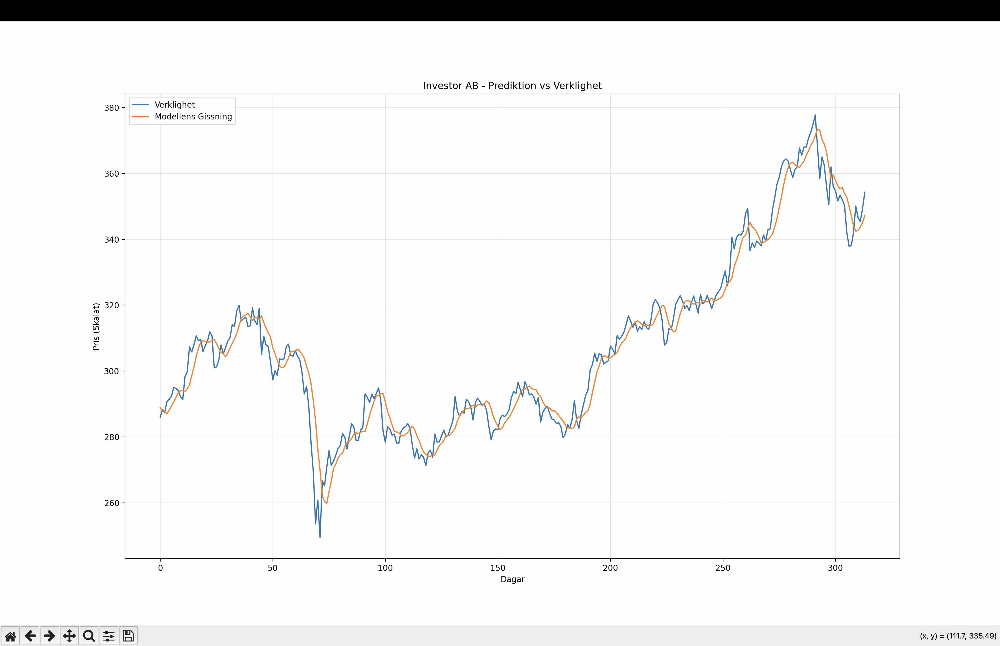

# 📈 Quantitative Stock Predictor

A time-series forecasting model built in Python to predict stock prices (e.g., Investor AB) using **Linear Regression** and **Gradient Descent**, implemented entirely from scratch using NumPy.

## 🚀 Purpose
The goal of this project was to dive deep into the mechanics of Machine Learning. By avoiding high-level libraries like sickit-learn for the model implementation, I gained a hands-on understanding of:
* **Mathematical Optimization:** Manual implementation of Gradient Descent and Mean Squared Error (MSE).
* **Data Engineering:** Building an automated ETL pipeline to handle raw financial API data.
* **Algorithm Design:** Transforming time-series data into a supervised learning format via sliding window matrices.

## 🛠 Technical Stack
* **Python 3.12**
* **NumPy:** Vectorized matrix operations.
* **Pandas:** Data manipulation and MultiIndex cleaning.
* **Matplotlib:** Performance visualization.
* **yfinance:** Real-time market data retrieval.

## 📊 Mathematical Foundation
The model predicts the price $\hat{y}$ as a linear combination of previous closing prices:
$$\hat{y} = \theta_0 + \theta_1 x_1 + \theta_2 x_2 + \dots + \theta_n x_n$$

Weights are optimized by minimizing the Cost Function:
$$J(\theta) = \frac{1}{2m} \sum_{i=1}^{m} (h_\theta(x^{(i)}) - y^{(i)})^2$$

## 📈 Results & Analysis
The model demonstrates clear convergence in the cost history, proving that the Gradient Descent algorithm successfully minimizes the prediction error.

## 📊 Results Visualization
To verify the model's performance, I monitored the cost function during training and compared predictions against actual test data.

### Training Convergence
The loss curve shows a steady decrease in Mean Squared Error, indicating successful gradient descent.

### Prediction vs. Actual
This plot shows the model's ability to track price movements on the test set.

### Key Insights
During evaluation, the model exhibits the "Persistence Effect" where the strongest predictor for tomorrow's price is today's price. This is a common phenomenon in financial ML on efficient markets, highlighting the difficulty of capturing significant price swings and trend reversals that deviate from the previous day's close.

## 📂 Project Structure
* `model.py`: Custom Linear Regression class with Gradient Descent logic.
* `preprocessing.py`: Z-score normalization and matrix construction.
* `data_manager.py`: API integration and CSV persistence.
* `evaluate.py`: Plotting utilities for loss curves and prediction analysis.
* `main.py`: Orchestrates the full training and testing pipeline.

